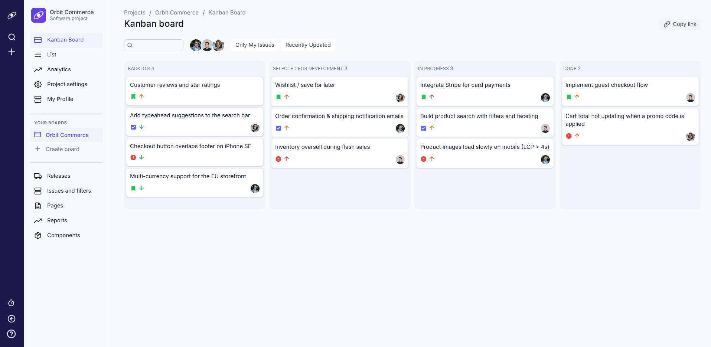
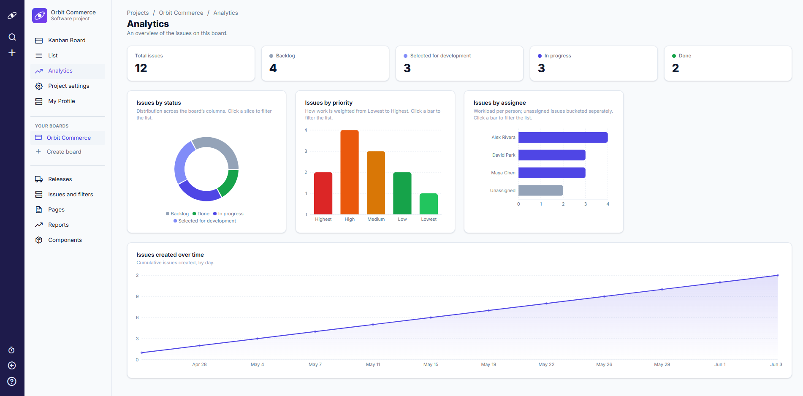
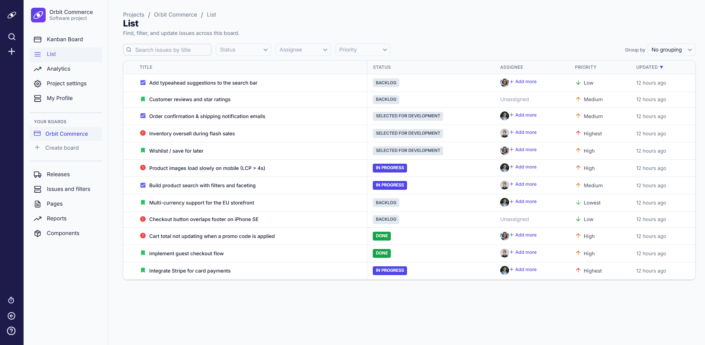
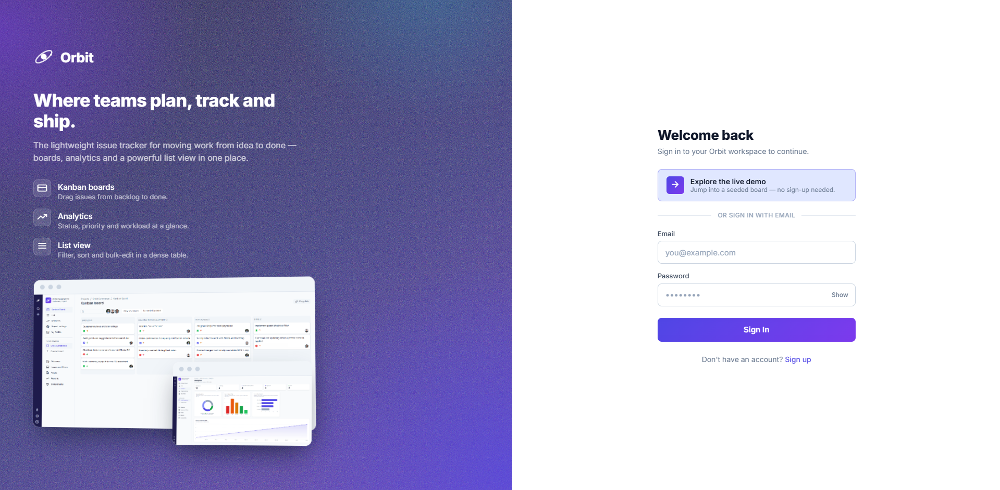

<div align="center">

# Orbit

### A modern issue & project tracker — plan, track, and ship work from idea to done.

React 19 · Express 5 · TypeScript · PostgreSQL · styled-components

</div>

Orbit is a full-stack project-management app in the spirit of Jira or Linear: a
drag-and-drop **Kanban board**, an **analytics dashboard**, a fast **filterable
list view**, rich-text issues with comments, and a polished authentication
experience — all on an indigo/violet design system driven by shared design
tokens. It's built for small product and engineering teams who want to see work
move across a board and understand it at a glance.

> **Note:** Orbit is a personal portfolio project built to demonstrate
> production-quality full-stack engineering and product design. It is not a
> commercial product and has no real users.

---

## Live demo

**Live app:** _`<!-- TODO: add deployed URL once hosted -->`_ (not yet deployed —
runs locally with the steps below)

The fastest way to try Orbit is the **one-click demo login**. On the sign-in
screen, click **“Explore the live demo.”** It provisions a fresh workspace —
a seeded board with example issues, users, and comments — and drops you straight
into the product. No signup, no credentials.

You can also create a real account with email and password, or sign in to an
existing one.


<div align="center"><sub>The Kanban board — drag issues between columns to update their status.</sub></div>

---

## Features

### Kanban board
A drag-and-drop board with Backlog, Selected for development, In progress, and
Done columns. Issues carry a type, priority, assignees, and a rich-text
description, and update optimistically as you move them.


<div align="center"><sub>Drag-and-drop board powered by @hello-pangea/dnd.</sub></div>

### Analytics dashboard
A board-level dashboard that aggregates issues on the client into stat cards and
charts: distribution by status, priority, and assignee, plus issues created over
time. Cards and charts deep-link into a filtered list.


<div align="center"><sub>Client-side analytics rendered with recharts, themed to the Orbit tokens.</sub></div>

### List view
A dense, sortable, filterable table of the board's issues. Search, filters,
sorting, and grouping live in the URL, so any view is shareable and restores on
reload. Supports inline and bulk edits.


<div align="center"><sub>URL-driven list view with inline editing.</sub></div>

### Authentication
A split-layout sign-in / sign-up experience with a branded product showcase,
inline validation, and a prominent one-click guest demo. Auth is JWT-based, with
bcrypt-hashed passwords on the server.


<div align="center"><sub>Sign-in screen with a first-class “Explore the live demo” entry point.</sub></div>

---

## Tech stack

| Layer        | Technology                                                                                          |
| ------------ | --------------------------------------------------------------------------------------------------- |
| **Frontend** | React 19, React Router 7, styled-components 6, @hello-pangea/dnd (drag-and-drop), recharts (charts), Quill (rich text), Formik, axios — bundled with Webpack 5 |
| **Backend**  | Node.js, Express 5, TypeScript (strict), TypeORM 0.3 over PostgreSQL                                 |
| **Auth**     | JWT bearer tokens (jsonwebtoken), bcrypt password hashing, one-click guest/demo seeding             |
| **Tooling**  | ESLint 10 (flat config), Prettier 3, Husky + lint-staged, pm2 (production), Cypress 15 (end-to-end) |

The frontend is plain JavaScript with PropTypes; the backend is TypeScript in
strict mode. A central design-token module (`client/src/shared/utils/styles.js`)
is the single source of truth for color, type, spacing, and shadow.

---

## Getting started

### Prerequisites

- **Node.js** 20+
- **PostgreSQL** 13+

### 1. Clone and install

```bash
git clone https://github.com/sumairq/jira-clone.git
cd jira-clone
npm run install-deps      # installs the root, api/, and client/ packages
```

### 2. Configure the backend environment

Copy the example file and fill in your own values:

```bash
cp api/.env.example api/.env
```

`api/.env` expects the following variables:

| Variable      | Description                                  |
| ------------- | -------------------------------------------- |
| `DB_HOST`     | PostgreSQL host                              |
| `DB_PORT`     | PostgreSQL port                              |
| `DB_USERNAME` | PostgreSQL user                              |
| `DB_PASSWORD` | PostgreSQL password                          |
| `DB_DATABASE` | Database name (e.g. `orbit_development`)     |
| `JWT_SECRET`  | Secret used to sign auth tokens              |
| `PORT`        | Port the API listens on (e.g. `3000`)        |

Create the database referenced by `DB_DATABASE` before starting. The schema is
generated automatically from TypeORM entities on boot (`synchronize: true`) —
there are no migrations, so there's no separate migrate step.

### 3. Run the app

In two terminals:

```bash
# Terminal 1 — API (http://localhost:3000)
cd api && npm start

# Terminal 2 — client (http://localhost:8080)
cd client && npm start
```

Then open **http://localhost:8080**.

### 4. Get in instantly

No seed script is required. On the sign-in screen, click **“Explore the live
demo”** — the `POST /authentication/guest` endpoint seeds a fresh workspace
(users, a board, example issues, and comments) and signs you straight in. You can
also register a real account or sign in with one.

> The client reads its API base URL from `API_URL` and defaults to
> `http://localhost:3000` in development, so the steps above work with no extra
> configuration.

---

## Project structure

```
.
├── api/                 Express + TypeORM backend (TypeScript)
│   └── src/
│       ├── controllers/     thin request handlers
│       ├── entities/        TypeORM entities + validation
│       ├── database/        connection + guest-account seeder
│       ├── middleware/      response helper, auth, error handling
│       ├── errors/          typed error classes
│       └── utils/           persistence + validation helpers
│
├── client/              React frontend (JavaScript + PropTypes)
│   └── src/
│       ├── Auth/            sign-in / sign-up + guest demo
│       ├── Project/         Board, Analytics, List, settings, modals
│       └── shared/          components, hooks, utils, design tokens
│
├── docs/screenshots/    images used in this README
└── package.json         root orchestrator (install-deps, build, start)
```

---

## Roadmap

A few directions I'd build next: a hosted live demo, due dates and labels on
issues, real-time board updates, and a dark theme.

---

## License

Released under the **MIT License** (declared in `package.json`).
_`<!-- TODO: add a LICENSE file to the repo root -->`_
